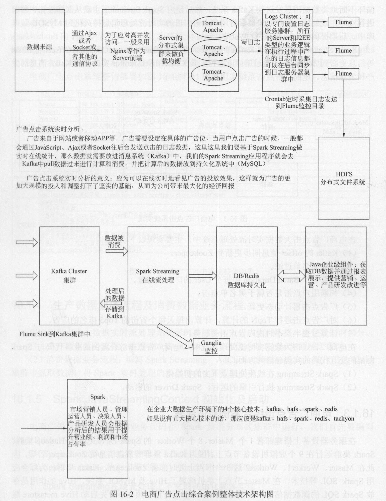

电商广告点击大数据实时流处理系统案例
---

### 16.1 电商广告点击综合案例需求分析和技术架构
综合应用 Spark + Streaming + Kafka + Spark SQL + TopN + MySQL  

电商系统包括用户行为分析、页面浏览表、跳转率、用户登录信息、什么商户比较受欢迎、用户广告点击信息、个性化推荐系统等内容。  
  
#### 电商广告点击综合案例的核心需求：
* （1）实时黑名单动态过滤出有效的用户广告点击行为；因为黑名单用户可能随机出现，所以需要动态更新  
* （2）在线计算广告点击流量  
* （3）Top3热门广告  
* （4）每个广告的流量趋势
* （5） 广告点击用户的区域分布分析
* （6）最近一分钟的广告点击量
* （7）整个广告需7 * 24小时运行。
  
  
#### 技术细节：
    * 数据格式：时间、用户、广告、地点等。
    * 在线计算用户点击的次数分析、屏蔽IP等
    * 使用updataStateByKey或者mapWithState进行不同地区广告点击排名的计算。
    * Spark Streaming + Spark SQL + Spark Core等综合分析数据。
    * 使用Window类型操作
    * 高可用和性能调优。
    * 流量趋势一般会结合DB等
    
#### 架构图

    
  
#### 在电商广告点击撒数据实时流处理系统中，主要实现一下功能：  
    * Kafka的offset信息同步更新到Zookeeper  
    * 在线黑名单过滤。  
    * 计算每个Batch Duration中每个User的广告点击量。
    * 判断用户点击量是否属于黑名单点击。
    * 广告点击累计动态更新
    * 对广告点击进行TopN计算，计算出每天每个省份的Top5排名的广告。
    * 计算过去**半个小时**内广告点击的趋势。
    
    
#### 对于集群而言，每个Executor一般肯定不止一个Thread，那对于处理Spark Streaming的应用程序而言，每个Executor一般分配多少个Core比较合适？
**根据经验，5个左右的Core是最佳的（一般分配为奇数个Core表现最佳，如3个、5个、7个Core等）**

#### Spark Streaming读取Kafka数据的方式  
* （1） Receiver方式： Spark Streaming KafkaUtil使用createStream方法；  
* （2） No Receiver方式： Spark Streaming KafkaUtil使用createDirectStream方法；  

**目前，No Receiver方式在企业中使用的越来越多，具有更强的自由度控制、语义一致性。  
好处有：
一、它可以直接抓取Kafka的数据，没有缓存，不会出现内存溢出的问题。
如果使用kafka Receiver方式读取数据，会存在缓存的问题，需要设置Kafka Receiver读取的频率和Block interval等信息。

二、Receiver方式需要和Worker的Executor绑定，不方便做分布式。
No Receiver direct方式，默认分布在多个Executor上。而Receiver方式不方便计算。

三、是用Receiver方式消费数据其中有一个弊端，消费数据来不及处理，如果延迟多次，Spark Streaming程序就有可能崩溃。
但如果采用No Receiver direct方式访问Kafka数据，就不会存在这个问题，因为No Receiver direct方式就不会存在来不及消费、程序崩溃的问题。  

四、No Receivers direct 方法实现完全的语义一致性，不会重复消费数据，而且保证数据一定被消费。No Receiver direct方式与Kafka进行交互，
只有数据真正执行成功后才会记录下来。
    
    
    
  

